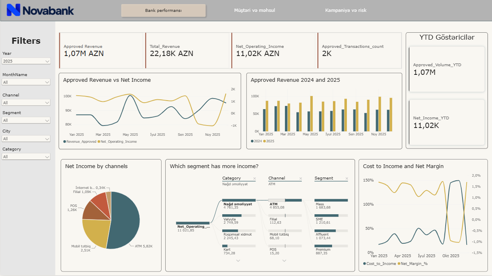
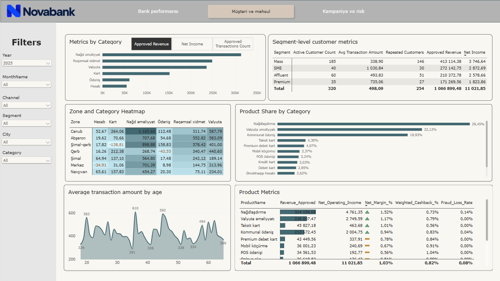
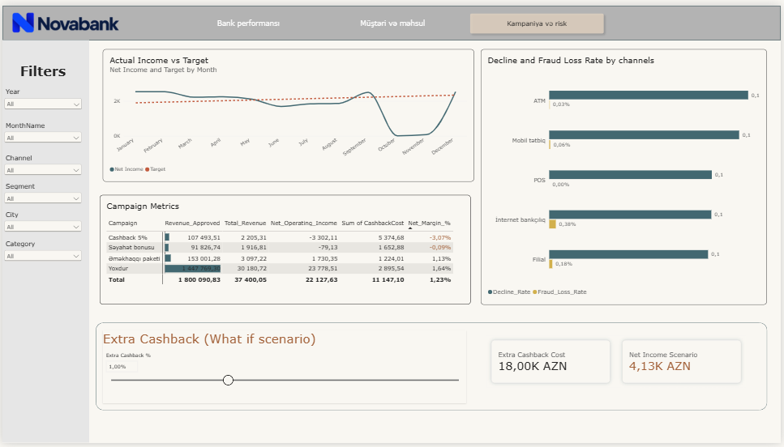

# NovaBank — Power BI Performance Dashboard

An interactive 3-page Power BI dashboard analyzing two years (2024–2025) of transaction data for a fictional bank, NovaBank. The project covers data cleaning, a star-schema data model, 35+ DAX measures (time intelligence, dynamic parameters, scenario modeling), and a business-question-driven analysis with concrete recommendations.

  

---

## Overview

- **Scope:** ~4,500 cleaned transactions (from 4,524 raw rows, exact duplicates removed), across Customers, Products, Branches, and Targets dimension tables.
- **Goal:** Answer 10 business questions about revenue, profitability, risk, and campaign performance — with numbers, not opinions.
- **Deliverable:** A `.pbix` file with 3 interactive report pages, a vertical page navigator, a reset bookmark, slicers, and a cashback what-if scenario.

> **Note:** The dataset is a synthetic dataset created for this project; it does not represent a real financial institution.

---

## Tools & Techniques

- **Power Query** — data cleaning, duplicate removal, data model shaping
- **DAX** — `CALCULATE`, `SAMEPERIODLASTYEAR`, `TOTALYTD`, `DATESINPERIOD`, `REMOVEFILTERS`, `SUMMARIZECOLUMNS`, `TOPN`, field parameters, what-if parameters
- **Data modeling** — star schema, active date-table relationships, Display Folders for a clean Fields pane
- **Visual design** — conditional formatting (data bars, icons, color scales), Decomposition Tree, heatmaps, Edit Interactions for isolated plan/target visuals

Full measure list with formulas: [`docs/dax_measures.md`](docs/dax_measures.md)

---

## Dashboard Pages

### 1. Bank Performance
KPI cards (approved volume, net operating income, margin, transaction count), monthly volume vs. net income trend, YoY/YTD indicators, and a channel / segment / category comparison showing that volume and profit don't always move together.


### 2. Customer & Product Analysis
Segment-level metrics (active customers, average transaction, repeat-customer rate), a field-parameter chart toggling between volume / net income / transaction count, a city × category heatmap, and each product's share within its own category.



### 3. Campaign & Risk
Campaign comparison (volume, revenue, cashback, margin), channel-level decline rate and fraud loss, monthly plan vs. actual net income, and an interactive extra-cashback what-if scenario (0–3%).



---

## Key Findings

1. **Volume and profit diverge in May** — volume peaked at 100,605.98 AZN, but net income grew far more slowly.
2. **October–November turned unprofitable** — Cost to Income hit 145% and 150%, pushing net income negative (-859.43 / -1,016.85 AZN).
3. **ATM leads on both volume and profit** — the "high volume = low margin" assumption doesn't hold here (5,816.67 AZN net income, the highest of any channel).
4. **The 5% cashback campaign is loss-making** — highest-volume campaign (107,493.51 AZN), but a -3.1% net margin, versus +1.7% for non-campaign transactions.
5. **Fraud loss is concentrated in internet banking** — 0.50% vs. 0.05% (ATM) and 0.03% (mobile).
6. **Credit cards are the only product with negative margin** — -0.6%, despite being compared against 11 other profitable products.

See [`docs/dax_measures.md`](docs/dax_measures.md) for the underlying formulas.

---

## Recommendations

| # | Recommendation | Risk | KPI to monitor |
|---|---|---|---|
| 1 | Restructure the 5% cashback campaign — lower it to ~3% and target only high-margin products | Lower incentive may reduce uptake | Campaign `Net_Margin_%` |
| 2 | Investigate the Oct–Nov cost spike (cashback / processing / fraud breakdown) and add a monitoring check | May recur if root cause isn't found | Monthly `Cost_to_Income` |
| 3 | Re-evaluate credit card pricing — the only product with negative margin | Tighter terms risk customer attrition | Credit card `Net_Margin_%` |

---

## Repository Structure

```
NovaBank-PowerBI-Dashboard/
├── README.md
├── NovaBank_Dashboard.pbix
├── data/
│   └── NovaBank_Dataset.xlsx
├── screenshots/
│   ├── page1_bank_performance.png
│   ├── page2_customer_product.png
│   └── page3_campaign_risk.png
└── docs/
    └── dax_measures.md
```

---

## Author

**Aslan Rustamov**
· [LinkedIn](https://www.linkedin.com/in/rustamovaslan)
